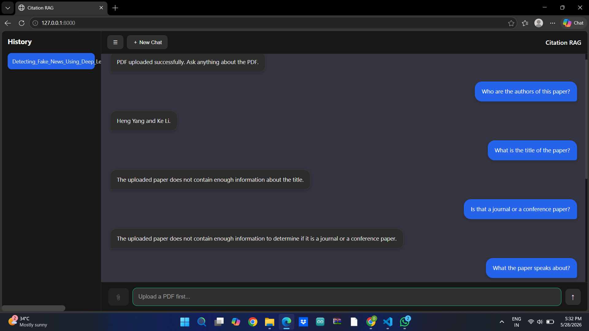

# Citation_RAG

An intelligent Research Paper Assistant that allows users to upload PDFs and chat with them using **Retrieval-Augmented Generation (RAG)**. It provides accurate, context-aware answers with citations directly from academic papers.

---



## ✨ Features

- 📄 **PDF Upload & Processing** with improved document chunking
- 🔍 **Semantic Search** using BGE Embeddings and ChromaDB
- 💬 **Per-Session Chat** (each uploaded paper maintains its own conversation)
- 📚 **Citation Support** – Answers include `[Source X]` references
- 🏷️ **Special Handling** for Title, Authors, and General Questions
- 🔄 **Query Rewriting** for enhanced retrieval performance
- 💾 **Chat History Persistence**
- ⚡ **Fast & Lightweight** architecture powered by Groq + Llama-3.1

---

## 🛠️ Tech Stack

| Component | Technology |
|------------|------------|
| Backend | FastAPI |
| LLM | Groq (Llama-3.1-8B-Instant) |
| Embeddings | BAAI/bge-base-en-v1.5 |
| Vector Store | ChromaDB |
| Document Loader | PyMuPDF |
| Framework | LangChain |

---

## 📁 Project Structure

```text
Citation-RAG/
│
├── chat_sessions/                  # Session-wise data
│   └── <session_id>/
│       ├── chroma_db/              # Vector database
│       ├── chat_history.json       # Stored chat history
│       └── pdf_folder/             # Uploaded PDF files
│
├── Citation_RAG_bot/               # Main application folder
│   ├── main.py                     # FastAPI endpoints
│   ├── answering_rag_bot.py        # RAG response generation
│   └── embedding.py                # Embedding creation & storage
│
├── .env
├── requirements.txt
└── README.md
```

---

## 🚀 Installation & Setup

### 1. Clone the Repository

```bash
git clone <your-repository-url>
cd Citation-RAG
```

### 2. Create a Virtual Environment

#### Windows

```bash
python -m venv venv
venv\Scripts\activate
```

#### Linux / macOS

```bash
python -m venv venv
source venv/bin/activate
```

### 3. Install Dependencies

```bash
pip install -r requirements.txt
```

### 4. Configure Environment Variables

Create a `.env` file in the root directory:

```env
GROQ_API_KEY=gsk_xxxxxxxxxxxxxxxxxxxxxxxx
```

### 5. Run the Application

```bash
uvicorn Citation_RAG_bot.main:app --reload
```

The application will be available at:

```text
http://127.0.0.1:8000
```

---

## 🔄 Workflow

1. Upload a research paper (PDF).
2. PDF content is processed and chunked.
3. Embeddings are generated using **BGE Base Embeddings**.
4. Chunks are stored in **ChromaDB**.
5. User queries are rewritten for better retrieval.
6. Relevant chunks are retrieved using semantic search.
7. Groq's **Llama-3.1-8B-Instant** generates answers.
8. Responses include source citations and maintain chat history.

---

## 🎯 Key Highlights

- Session-specific vector databases
- Session-specific chat history
- Accurate citation-based responses
- Optimized retrieval through query rewriting
- Lightweight and production-friendly architecture
- Easy integration with any frontend

---

## 📜 License

This project is intended for educational and research purposes.
